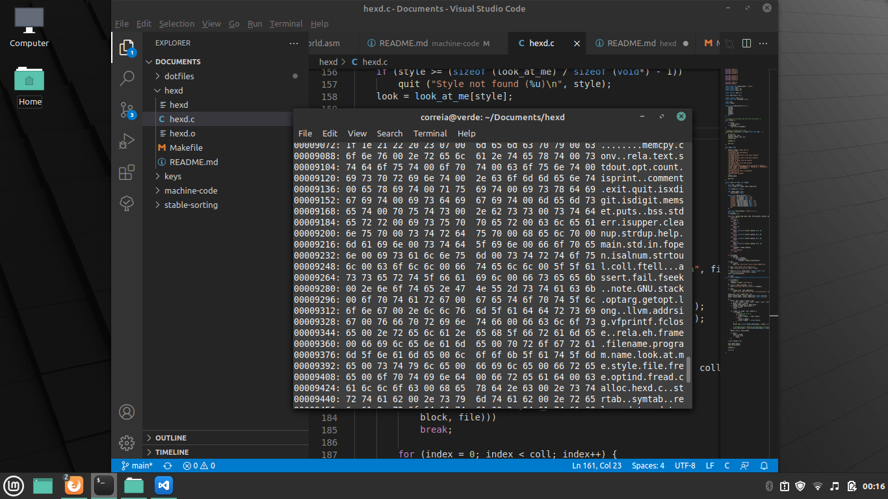

# hexd

A simplest hexadecimal file dumper for unix-like systems



## Features

Support:

- Dump hexa and octal bytes
- Can works with the standard input

## How to compile

```bash
make
```

## How to clean

```bash
make clean
```

## How to install

```bash
make install
```

## How to uninstall

```bash
make uninstall
```
